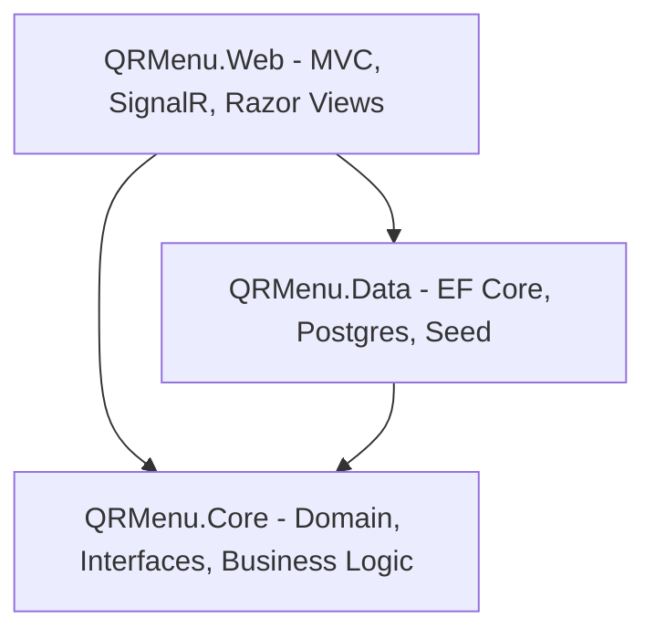

# 📊 QR Menü Otomasyon Sistemi

[](docs/Pdfler/QR%20Men%C3%BC%20Sistemi%20-%20Kullan%C4%B1m%20Rehberipdf.pdf)
[](docs/Pdfler/SAT_VizeRaporu_Burhan_Şahin_247017027.pdf)
[](https://github.com/brhnshn/QRMenu/blob/main/docs/Pdfler/QR%20Men%C3%BC%20%E2%80%94%20Final%20Raporu.pdf)

Restoran ve kafeler için tasarlanmış, çoklu rol desteğine (Müşteri, Garson, Mutfak, Kasa, Yönetici) sahip, gerçek zamanlı ve tam kapsamlı **QR Kod Tabanlı Sipariş ve Otomasyon Sistemi**. Bu sistem, yerel geliştirme süreçlerinden canlı sunucu ortamındaki (Production) yayına kadar modern yazılım mimarileri, veri tabanı eşzamanlılığı, OWASP Top 10 güvenlik prensipleri ve CI/CD otomasyonu gözetilerek hayata geçirilmiştir.

---

## 🏛️ Proje Mimarisi (Clean Architecture)

Proje, bağımlılıkları en aza indiren, sürdürülebilir, test edilebilir ve ölçeklenebilir **Clean Layered Architecture (Katmanlı Mimari)** yapısı üzerine kurulmuştur:



### 📁 Katman Detayları
1. **`QRMenu.Core` (Çekirdek Katmanı):**
   * **Domain Modelleri (Entities):** `Urun`, `Kategori`, `Siparis`, `Sepet`, `Masa`, `Kullanici`, `HappyHour`, `GunSonuRapor` vb. veri modellerini barındırır.
   * **Arayüzler (Interfaces):** Repository, UnitOfWork ve servislerin soyutlama tanımlarını içerir.
   * **İş Kuralları (Business Rules):** Diğer katmanlara bağımlılığı olmayan temel sistem kuralları.

2. **`QRMenu.Data` (Veri Katmanı):**
   * **PostgreSQL Bağlantısı:** Veri tabanı şeması ve konfigürasyonlarını yöneten `AppDbContext`.
   * **Repository & Unit of Work:** Veri erişim işlemlerinin tek merkezden yönetimini sağlar.
   * **Seed Data:** Sistem ilk ayağa kalktığında otomatik yüklenen kategoriler, ürünler, masalar ve varsayılan yönetici (Admin) kullanıcısı.
   * **EF Core Migrations:** Veri tabanı güncellemelerinin takibi.

3. **`QRMenu.Web` (Sunum Katmanı):**
   * **Controller & Razor Views:** Rol bazlı paneller (Admin, Garson, Mutfak, Kasa) ve müşteri ara yüzleri.
   * **SignalR Hubs (`OrderHub`):** Müşteri siparişi, garson çağırma ve kasa tahsilat bildirimlerinin gerçek zamanlı akışını sağlar.
   * **Middlewares (Ara Yazılımlar):** `SecurityLogMiddleware` (401, 403, 429 hata takibi), Rate Limiting ve Token Doğrulama mekanizmaları.
   * **Arka Plan Servisleri (HostedServices):** 2 saat işlem görmeyen masaları temizleyen, sahipsiz sepetleri ve eski pasif oturumları silen `OturumTemizleyici`.

---

## 🛠️ Kullanılan Teknolojiler ve Kütüphaneler

### 💻 Backend & Real-time
* **.NET 8.0 SDK / C#:** Modern nesne yönelimli backend altyapısı.
* **ASP.NET Core MVC:** Hızlı, SEO dostu ve esnek web mimarisi.
* **SignalR:** Gerçek zamanlı çift yönlü veri iletişimi.
* **Entity Framework Core (EF Core):** PostgreSQL üzerinde Code-First ORM aracı.

### 🗄️ Veri Tabanı
* **PostgreSQL (Supabase Entegrasyonu):** İlişkisel veri tabanı motoru.
* **AuditLog Interceptor:** Veri tabanı üzerindeki tüm yazma/güncelleme işlemlerinin JSON formatında otomatik loglanması.

### 🎨 Frontend & UI/UX
* **Tailwind CSS & Stitch Design System:** Sistem genelinde uygulanan terracotta kurumsal rengine (`#a23718`) sahip modern, responsive, Bento-Grid yapılı ve glassmorphic arayüz bileşenleri.
* **Chart.js:** Bento-Grid tabanlı Admin Dashboard ekranında finansal ve operasyonel verileri (Ciro, Doluluk, Ortalama Servis) görselleştiren grafik kütüphanesi.

### 📑 Ekstra Kütüphaneler
* **ClosedXML:** Z-Raporları ve sipariş verilerinin Excel dosyası olarak dışa aktarımı.
* **iText7:** Sipariş fişleri, mali raporlar ve güvenlik günlüklerini Türkçe karakter destekli PDF formatında üreten motor.
* **Google Translation API Helper:** Ürünlerin anlık Türkçe-İngilizce çevirisini yapan entegrasyon.

### 🛡️ Güvenlik Katmanı (OWASP Sıkılaştırması)
* **ASP.NET Identity:** Güvenli Cookie tabanlı oturum yönetimi.
* **Rate Limiting:** DDoS saldırılarını ve kaba kuvvet giriş denemelerini bloke eden IP bazlı koruma.
* **ValidateAntiForgeryToken:** Cross-Site Request Forgery (CSRF) koruması.
* **Strict Cookies:** Çerezlerin `HttpOnly`, `Secure` ve `SameSite=Strict` olarak yapılandırılması.

### 🧪 Test Süreçleri
* **xUnit & Moq:** Sipariş eşzamanlılığı, indirim zaman aralıkları ve stok kontrolleri gibi kritik akışları test eden **67 adet başarılı (Yeşil) Unit Test**.

---

## 🚀 Kurulum ve Çalıştırma Rehberi (Adım Adım)

### 📋 Ön Gereksinimler
* [**.NET 8.0 SDK**](https://dotnet.microsoft.com/download/dotnet/8.0) yüklenmiş olmalıdır.
* Çalışan bir [**PostgreSQL**](https://www.postgresql.org/) veri tabanı (yerel veya bulut/Supabase).

### 1. Projeyi Klonlayın
```bash
git clone https://github.com/brhnshn/QRMenu.git
cd QRMenu
```

### 2. Veri Tabanı Yapılandırması
`src/QRMenu.Web/appsettings.json` dosyasını açarak `ConnectionStrings` altındaki bağlantı cümlesini kendi veri tabanı bilgilerinize göre güncelleyin:
```json
"ConnectionStrings": {
  "DefaultConnection": "Host=<HOST>;Port=5432;Database=QRMenu;Username=<USER>;Password=<PASSWORD>"
}
```

### 3. Migrations Uygulama ve Veri Tabanı Oluşturma
Veri tabanını şemasını oluşturmak ve başlangıç verilerini (seed) yüklemek için terminalde şu komutu çalıştırın:
```bash
dotnet ef database update --project src/QRMenu.Data --startup-project src/QRMenu.Web
```

### 4. Projeyi Başlatma
Sunucuyu yerel ortamda çalıştırmak için:
```bash
dotnet run --project src/QRMenu.Web
```
Tarayıcınızdan `http://localhost:5000` (veya konsolda belirtilen port) adresini ziyaret ederek uygulamaya erişebilirsiniz.

### 5. Unit Testleri Çalıştırma
Sistemdeki tüm test senaryolarını test etmek için:
```bash
dotnet test
```

---


## 📂 Proje Dokümantasyonu ve İlerleme Raporları

Sistemin tüm aşamalarını, teknik analizleri ve haftalık ilerleme detaylarını içeren döküman dizini aşağıdadır:

| Rapor / Dosya | İçerik ve Açıklama | Bağlantı & Format |
|:---|:---|:---:|
| 📖 **KULLANIM REHBERİ** | Adım adım resimli sistem kullanım kılavuzu. | [**PDF İNDİR / GÖRÜNTÜLE**](docs/Pdfler/QR%20Men%C3%BC%20Sistemi%20-%20Kullan%C4%B1m%20Rehberipdf.pdf) |
| 📊 **FİNAL RAPORU (HAFTA 6-10)** | **Sistemin son aşamasını, veri tabanı kilitlenmelerini, canlı sunucu mimarisini özetleyen nihai proje raporu.** | [**PDF GÖRÜNTÜLE**](https://github.com/brhnshn/QRMenu/blob/main/docs/Pdfler/QR%20Men%C3%BC%20%E2%80%94%20Final%20Raporu.pdf) |
| 📊 **VİZE RAPORU (HAFTA 1-5)** | Projenin ilk yarısını, veri şemasını ve mimari seçimleri içeren ara rapor. | [**PDF İNDİR / GÖRÜNTÜLE**](docs/Pdfler/SAT_VizeRaporu_Burhan_Şahin_247017027.pdf) |
| **Plan Takvimi** | Projenin 10 haftalık zamanlama ve hedef tablosu. | [PDF](docs/10%20Haftalık%20Plan%20Takvimi.pdf) |
| **Dosya Yapısı** | Uygulamanın dizin hiyerarşisi ve dosya açıklamaları. | [PDF](docs/Pdfler/Proje%20Dosya%20Yapısı%20—%20QR%20Menü%20Otomasyonu.pdf) |
| **Hafta 1** | Proje Başlangıcı ve Veri Tabanı Mimarisi. | [PDF](docs/Pdfler/Hafta%201%20—%20Proje%20Kurulumu%20%26%20Veritabanı%20Altyapısı.pdf) |
| **Hafta 2** | Güvenli Oturum Sistemi ve Yetkilendirme. | [PDF](docs/Pdfler/Hafta%202%20—%20Güvenli%20Oturum%20Sistemi%20%2B%20Ekstra%20Geliştirmeler.pdf) |
| **Hafta 3** | Mobil Uyumlu Sepet ve Menü Sayfası. | [PDF](docs/Pdfler/Hafta%203%20—%20Sepet%20Sistemi%20(Veritabanı)%20%26%20Modern%20Mobil%20UX.pdf) |
| **Hafta 4** | Sipariş Yönetimi ve SignalR Bildirim Katmanı. | [PDF](docs/Pdfler/Hafta%204%20—%20Sipariş%20Motoru%2C%20Admin%20Siparişler%2C%20SignalR%2C%20UX%20İyileştirmeleri%2C%20CI_CD%2C%20Garson%20Çağır%2C%20Fiş%20Overlay%2C%20Saat%20Dilimi%20Fix.pdf) |
| **Hafta 5** | Personel Arayüzleri, ACID Tahsilat ve Unit Testler. | [PDF](https://github.com/brhnshn/QRMenu/blob/main/docs/Pdfler/Hafta%205%20%E2%80%94%20Personel%20Servisleri%20(Garson%2C%20Mutfak%2C%20Kasa)%2C%20Giri%C5%9F%20Sistemi%2C%20ACID%20Tahsilat%2C%20AuditLog%20%26%20%C3%9Cnite%20Testleri.pdf) |
| **Hafta 5-2** | Supabase Migrasyonu, Kalori Desteği ve Masa Durumları. | [PDF](https://github.com/brhnshn/QRMenu/blob/main/docs/Pdfler/Hafta%205-2%20%E2%80%94%20Veritaban%C4%B1%20Ta%C5%9F%C4%B1ma%2C%20G%C3%B6rsel%20Optimizasyonu%2C%20Kalori%20%C3%96zelli%C4%9Fi%2C%20QR%20Giri%C5%9F%20Fix%20%26%20Masa%20Durum%20Takibi.pdf) |
| **Hafta 6** | Dinamik Happy Hour İndirimleri ve Arka Plan Motorları. | [PDF](https://github.com/brhnshn/QRMenu/blob/main/docs/Pdfler/Hafta%206%20%C4%B0ndirim%20Saatleri%20ve%20di%C4%9Fer%20i%C5%9Fler.pdf) |
| **Hafta 7** | Oyunlaştırma (Çarkıfelek, Hafıza) ve Google Çeviri API. | [PDF](https://github.com/brhnshn/QRMenu/blob/main/docs/Pdfler/Hafta%207%20-%20%20Gelistirme%20Raporu.pdf) |
| **Hafta 8** | Bağımsız Layouts (Kabuklar), Garson/Mutfak Tablet UX. | [PDF](docs/Pdfler/8.%20Hafta%20Geli%C5%9Ftirme%20Raporu.pdf) |
| **Hafta 9** | Bento Grid Dashboard, ClosedXML & iText7 Finans Raporu. | [PDF](https://github.com/brhnshn/QRMenu/blob/main/docs/Pdfler/9.%20Hafta%20Geli%C5%9Ftirme%20Raporu%20-%20QR%20Men%C3%BC%20Sistemi.pdf) |
| **Hafta 10** | CI/CD GitHub Actions & Dinamik Admin Profil Yönetimi. | [PDF](docs/Pdfler/10_Hafta_Ozet_Raporu.pdf.pdf) |

---

## 👷 Geliştirici ve Katkıda Bulunanlar
Bu proje **Burhan Şahin** tarafından Sistem Analizi ve Tasarım dersi kapsamında geliştirilmiştir. Tüm hakları saklıdır © 2026.
